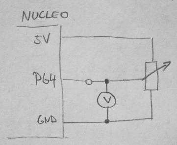

ProjektLEDtimer3 project
===========================

Účel/Zadání/Funkce
-----------------------

* parní mlátička s elektronickým vstřikováním
    * pára
    * píst
    * mikroprocesor

Schéma zapojení
-----------------------

Popis funkce
-----------------------

1. ono se to
2. samo se to

ToDo
-----------------------

* ještě chybí tamto

Zhodnocení
-----------------------

Na tomto projektu jsem se naučíl jedno a druhé a došlo mi jak funguje třetí.
Zlepšil jsem se v tamtom.

Svou práci bych ohodnotil chvalitebně, protože jsem nepracoval úplně samostatně,
ale vše jsem implementoval a prozkoumal.

Svou práci bych ohodnotil výborně. Nepracoval jsem sice samostatně,
ale nakonec jsem hotový projekt smazal a vytvořil ho celý znovu sám.
